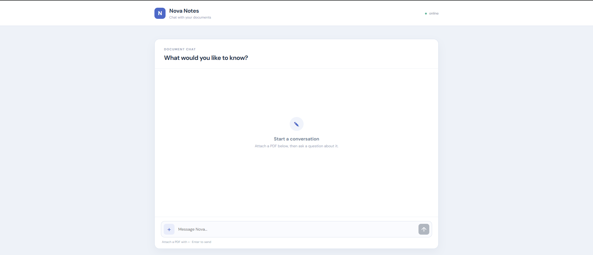

# Nova Document Room

A focused document workspace that lets users upload PDF sources, index them, and ask grounded questions through a conversational AI assistant.



## 🚀 Features

- **PDF Document Ingestion**: Upload and process PDF files into a vector database
- **Source-grounded chat**: Ask questions against your indexed documents
- **Conversation Memory**: Maintains context across multiple questions
- **Modern UI**: Editorial workspace with file upload and conversation tools
- **Observability**: Integrated with LangSmith for monitoring and tracing

## 🏗️ Architecture

### Backend (Node.js/Express)
- **Server**: Express.js API server with CORS and file upload support
- **Agent**: LangChain tool-using agent with Gemini
- **Vector Database**: Pinecone for document storage and similarity search
- **Embeddings**: Pinecone-hosted `llama-text-embed-v2` model
- **Observability**: LangSmith for tracing and monitoring

### Frontend (React/Vite)
- **UI Framework**: React with Vite for fast development
- **Styling**: Custom Nova Document Room interface
- **File Upload**: Drag-and-drop PDF upload with progress feedback
- **Chat Interface**: Real-time messaging with typing indicators

## 📋 Prerequisites

- Node.js (v18 or higher)
- npm or yarn
- Pinecone account with index created
- Gemini API key
- LangSmith account (optional, for observability)

## 🛠️ Setup

1. **Clone the repository**
   ```bash
   git clone <repository-url>
   cd nova-document-room
   ```

2. **Install dependencies**
   ```bash
   npm run install:all
   ```

3. **Environment Configuration**
   ```bash
   cp .env.example .env
   ```

   Edit `.env` with your API keys:
   ```env
   # LLM
   GOOGLE_API_KEY=your_gemini_api_key

   # Vector DB (Pinecone)
   PINECONE_API_KEY=your_pinecone_api_key
   PINECONE_INDEX=your_pinecone_index_name

   # LangSmith tracing
   LANGSMITH_TRACING=true
   LANGSMITH_ENDPOINT=https://api.smith.langchain.com
   LANGSMITH_API_KEY=langsmith_key
   LANGSMITH_PROJECT="Project name"
   ```

## 🚀 Running the Application

### Development Mode
```bash
npm run dev
```
This starts both the server (port 3001) and client (port 5173) concurrently.

### Individual Services
```bash
# Server only
npm run dev:server

# Client only
npm run dev:client
```

## 📁 Project Structure

```
agentic-personal-assistant/
├── server/                 # Backend API server
│   ├── index.js           # Express server and API routes
│   ├── agent.js           # Agent logic and memory management
│   ├── tools.js           # Knowledge base search tool
│   ├── ingest.js          # PDF ingestion pipeline
│   └── package.json       # Server dependencies
├── client/                # Frontend React app
│   ├── src/
│   │   ├── App.jsx        # Main application component
│   │   ├── App.css        # Nova workspace styling
│   │   └── main.jsx       # React entry point
│   └── package.json       # Client dependencies
├── .env.example           # Environment variables template
├── package.json           # Root package with scripts
└── README.md              # This file
```

## 🔄 How It Works

### Document Ingestion
1. User uploads PDF via frontend
2. Server receives file and extracts text using PDFLoader
3. Text is split into chunks (1000 chars with 200 overlap)
4. Chunks are converted to embeddings using Pinecone's model
5. Embeddings are stored in Pinecone vector database

### Chat Flow
1. User sends a message
2. Agent receives message with conversation history
3. Agent decides whether to search the knowledge base
4. If needed, searches Pinecone for relevant document chunks
5. Agent uses retrieved context to generate response
6. Response is sent back to user and added to conversation history

## 🔧 Key Components

### Agent (`server/agent.js`)
- ReAct agent using LangChain's `createAgent`
- MemorySaver for conversation persistence
- Tool calling for knowledge base search

### Search Tool (`server/tools.js`)
- Pinecone vector store integration
- Similarity search with top-k results
- Lazy initialization for environment variables

### Ingestion Pipeline (`server/ingest.js`)
- PDF text extraction and chunking
- Batch processing (96 chunks per API call)
- Pinecone upsert operations

### Frontend (`client/src/App.jsx`)
- React state management for chat and upload
- File upload with progress feedback
- Real-time chat interface with auto-scroll

## 🐛 Troubleshooting

### Common Issues

1. **Connection Refused Error**
   - Ensure server is running on port 3001
   - Check for port conflicts: `lsof -i :3001`

2. **Environment Variables Missing**
   - Verify `.env` file exists in server directory
   - Check all required API keys are set

3. **Pinecone API Errors**
   - Verify Pinecone index exists
   - Check API key permissions
   - Ensure embedding model matches ingestion/retrieval

4. **Dependency Installation Errors**
   - Use `--legacy-peer-deps` flag for peer dependency conflicts
   - Clear node_modules and reinstall if needed

## 📚 Technologies Used

- **Backend**: Node.js, Express.js, Multer
- **Frontend**: React, Vite
- **AI/ML**: LangChain, Google Gemini
- **Vector DB**: Pinecone
- **Observability**: LangSmith
- **Development**: Concurrently, ESLint

## 🤝 Contributing

1. Fork the repository
2. Create a feature branch
3. Make your changes
4. Test thoroughly
5. Submit a pull request

## 📄 License

This project is licensed under the MIT License.
